# Food Donation Brazil

Food Donation Brazil is a website that helps people, community and NGOs (Non-governmental organization) to provide food to severe people in Brazil. As the last few years after started the pandemic the number of people without anything to eat day-by-day in Brazil increase. This number reported in a Survey from the National Survey on Food Insecurity 2021 provided a context of the enviroument. [READ the Report.](http://olheparaafome.com.br/VIGISAN_AF_National_Survey_of_Food_Insecurity.pdf)

The report suggest around 9% of the brazilian population is in severe food insecurity - that is, 19 million people.

The data are available in 3 languages on the website [OLHE PARA A FOME (LOOK AT THE HUNGER).](http://olheparaafome.com.br/#manifestu)

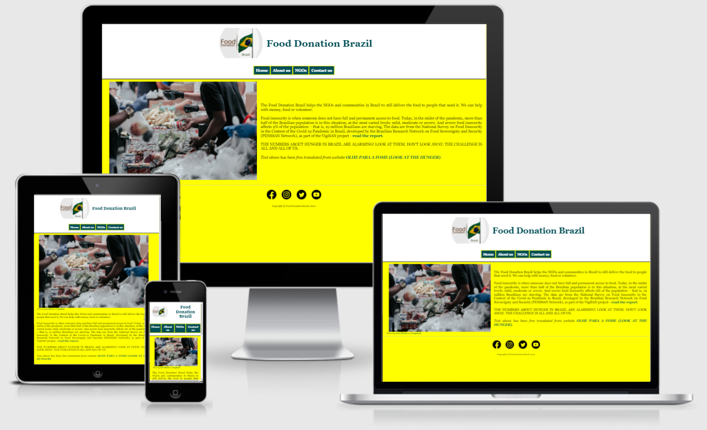

--------------
## Portfolio Project 1

### Purpose
This Website is created for the purpose of completing the first Portfolio Project for the Code Institute's Full Stack Developer course. It was built using the knowledge gained from the HTML and CSS Modules.

But it includes data of real-life and a real purpose of the project.

-------------
## User Experience Design

### First Time Visitor Goals

- To easily understand the main purpose of the site and learn more about the organisation.
- To be able to easily navigate throughout the site to find content.
- To view the website and content clearly on mobile devices.

### Returning Customer Goals

- To get more information and details regarding how they can help the people.
- To contact the organisations so they can help and get more information.

### Frequent Visitor Goals

- To check data regarding NGOs working with food donation for Brazil.
- To check how they can help on this propose.
- To register to help with one or more ways available.

### SiteMap

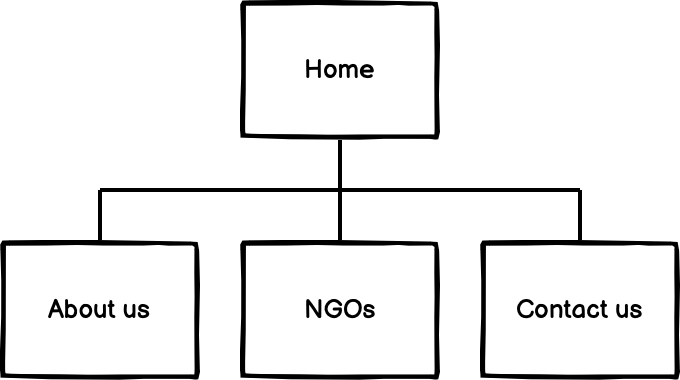

### WireFrame 

#### Home

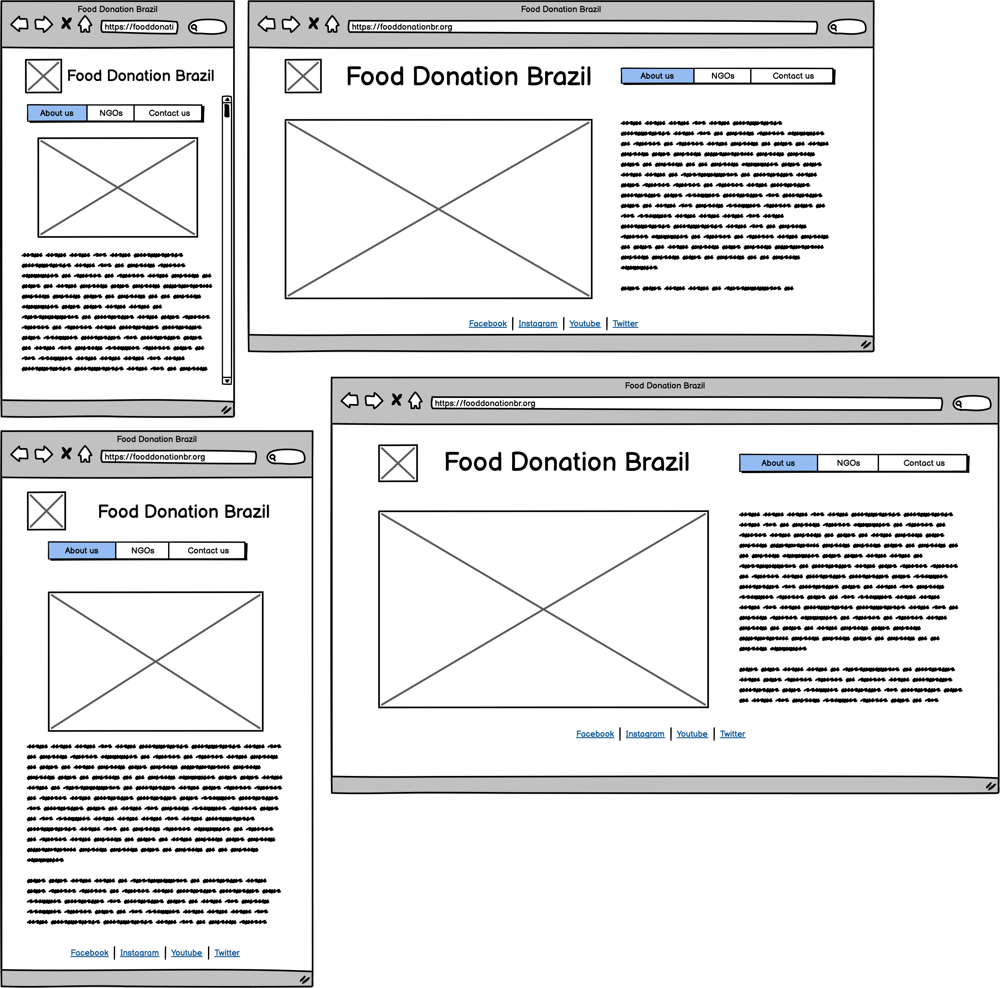

#### About us

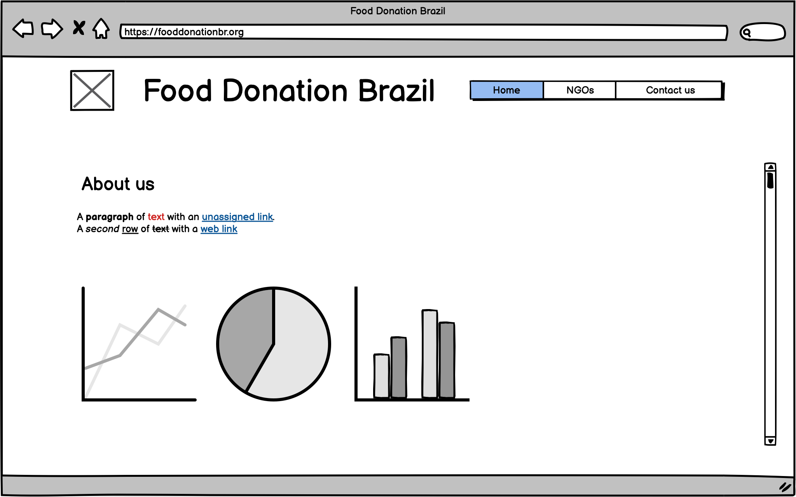

#### NGOs (Non-governmental organization)

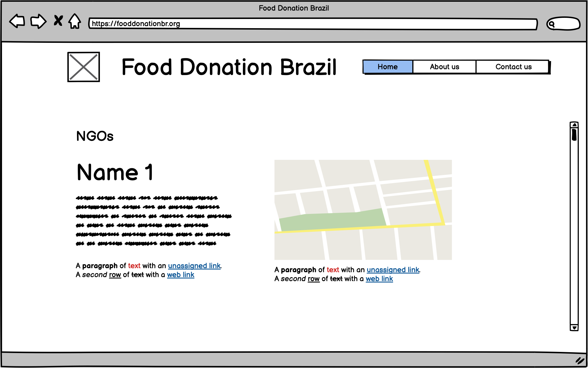

#### Contact us

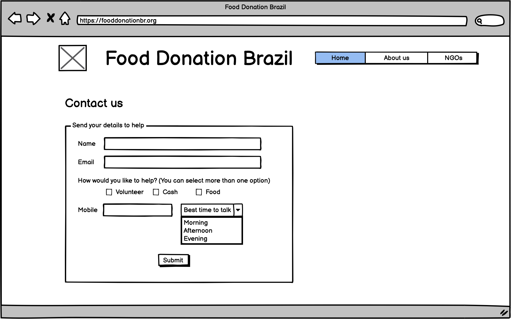

------------

## Design

All Pages contain a Navigation menu at the top of the Webpage that directs the user to a new Page to allow users to Navigate the site easily. The Nav Menu is positioned on the center to make user easy navegate in any device.

Color - The Color scheme is Brazil flag colors to convince the user that case is helping brazilian people.

Typography - The Font used in this project is called "Times New Roman", that one is generic font family.

Background - I used the yellow that a strong color in brazilian flag, utilizated in a lot of places to represent the sun in Brazil.

-------------------

## Business Goals

* To show the user how to help with the food issue in Brazil.
* Provide Further information about data food survey after COVID-19 pandemic.
* Gain people around the world to help with this case.

## Target Audience

* Users looking to help starving people.
* Users looking to see what's happining in Brazil after COVID-19 pandemic.

## User Goals

* Help each other.
* Familiar with case starving people in Brazil.

----------
## Features 

### Existing Features

- __Navigation Bar__

  - Featured on all four pages, the full responsive navigation bar includes Logo image, Title of website, Home page,about us page, NGOs page and Contact us page and is identical in each page to allow for easy navigation.
  - This section will allow the user to easily navigate from page to page across all devices without having to revert back to the previous page via the ‘back’ button. 

- __Home Page__

  - The home includes a photograph with text reference below to allow the user to see exactly which location site and author of this picture. 
  - This section introduces the user to Food Donation Brazil with details regarding National Survey report and where all this data comes from.

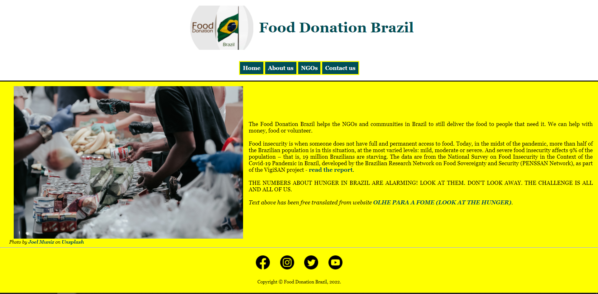

- __About us Page__

  - The about us page will allow the user to see more details regarding the case and National report survey in Brazil. 
  - How the user can help in this case and who they can help with data diagram picture.

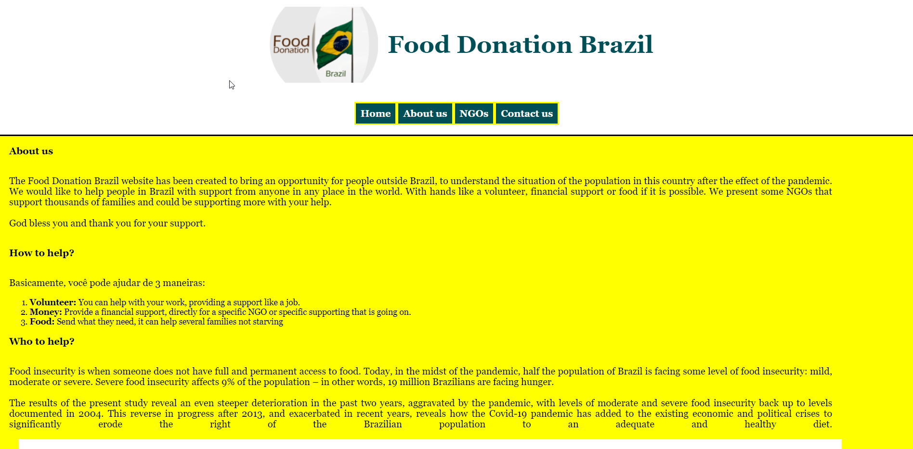

- __NGOs Page__

  - This page will allow the user to see some NGOs (Non-governmental organizations) that can help local in Brazil.
  - There are contact details and map address from each NGO with link to redirect the user to NGO website when they can find more details.

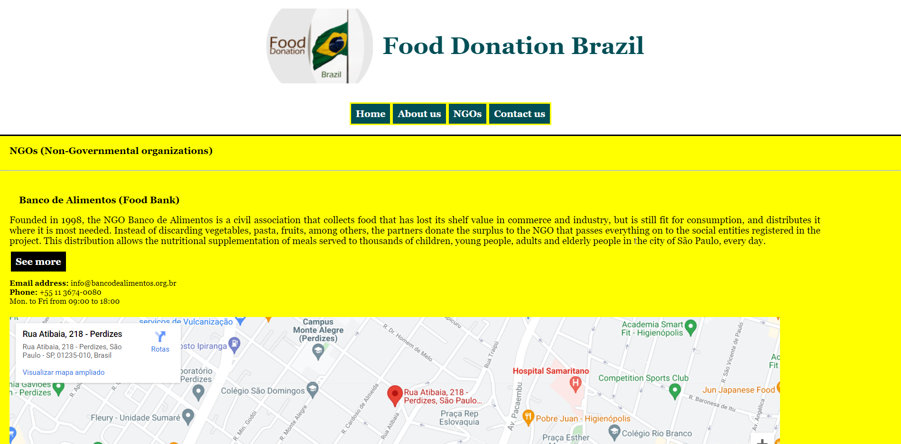

- __Contact us Page__

  - This page will allow the user to get details regarging users interested to help with ways available. The user will be able specify if they would like to take part of volunteers, help with money or food. The user will be asked to submit their name, email address and mobile phone. 

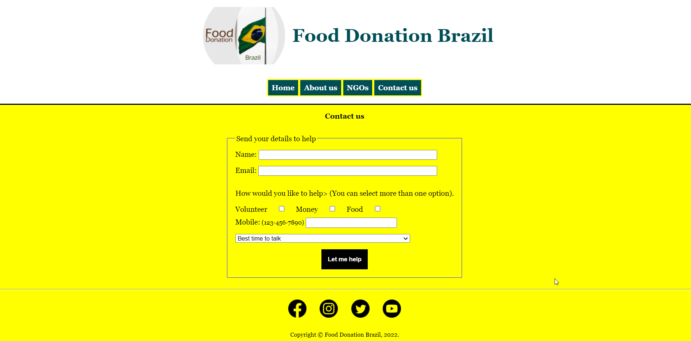

- __The Footer__ 

  - The footer section includes links to the relevant social media sites for Food Donation Brazil. The links will open to a new tab to allow easy navigation for the user. 
  - The footer is valuable to the user as it encourages them to keep connected via social media.
  - In the footer has copyright information with year of the site created.

### Features Left to Implement

- Translate this site in other 2 different languages (Portuguese and Spanish).

----------  
## Testing 

All pages have been tested across all screen sizes for a responsive experience and web pages have been Styled accordingly.
During this time I realised I made some silly mistakes mainly with sizing and had to go back through and change some size values to work correctly.

Once testing was completed and I was happy with the result I used validators to ensure my code was up to standard and best practices. I did this using W3C validator for HTML, Jigsaw Validator for CSS, WAVE (Web Accessibility Evaluation Tool) and Lighthouse in Google Chrome.

As this project is static and contains no back-end functionality at this time, the testing performed was on the visual effects and layout of the Website. Testing has been done on at least four web browsers and all screen sizes down to 320px wide.

All nav links direct to the correct html pages as per their names. The Home page is the exception, this one will redirect to index.html.

All links to external websites open in a new browser.

All links show a difference in Color when you hover over the link.

All images are responsive.

### Devices
* I have tested responsiveness and functionality on the following devices and browsers:
    * Apple:
      * Ipad mini
      * Iphone 7
      * Iphone 11
      * Iphone 12
      * Iphone 13 Pro Max

    * Desktops/laptops:
      * Dell XPS15 9570 Laptop
      * MacBook Air
 
    * Browsers:
      * Chrome
      * Edge
      * Firefox
      * Safari

### Validator Testing 

- HTML
  - Some errors and warnings have been found when validated the code through official W3C HTML Validator. All of them has been fixed.\
  -- About us Page --\
  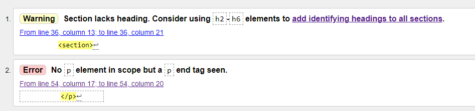\
  -- Home Page --
  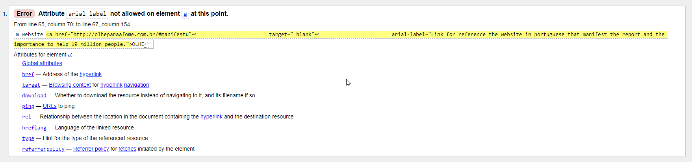\
   -- NGOs Page --
  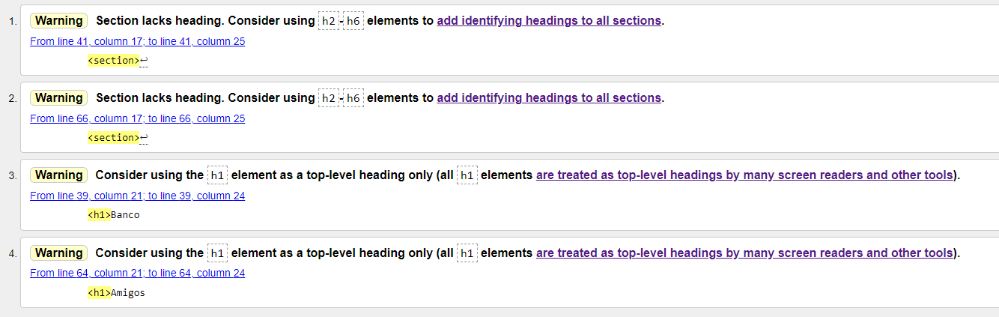\
  [HTML - W3C HTML Validator](https://validator.w3.org/)

- CSS
  - No errors were found when passing through the official Jigsaw CSS Validator. \
  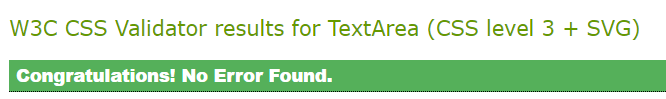\
  [CSS - Jigsaw CSS Validator](https://jigsaw.w3.org/css-validator/)

### Lighthouse - Dev Tools

#### Home
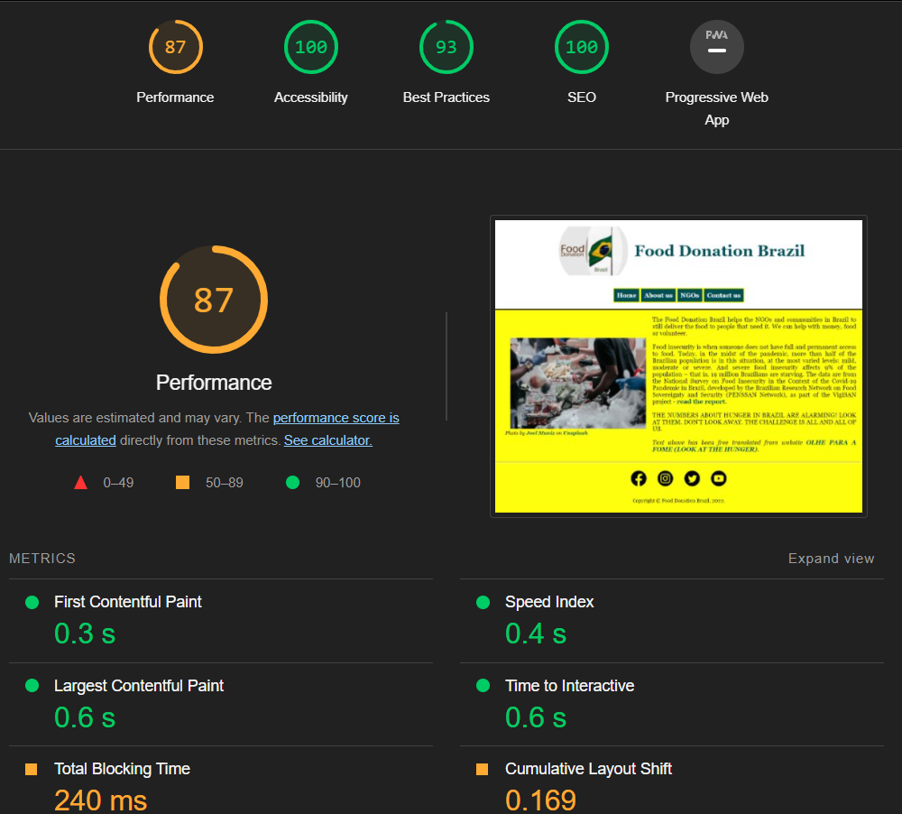

#### About us
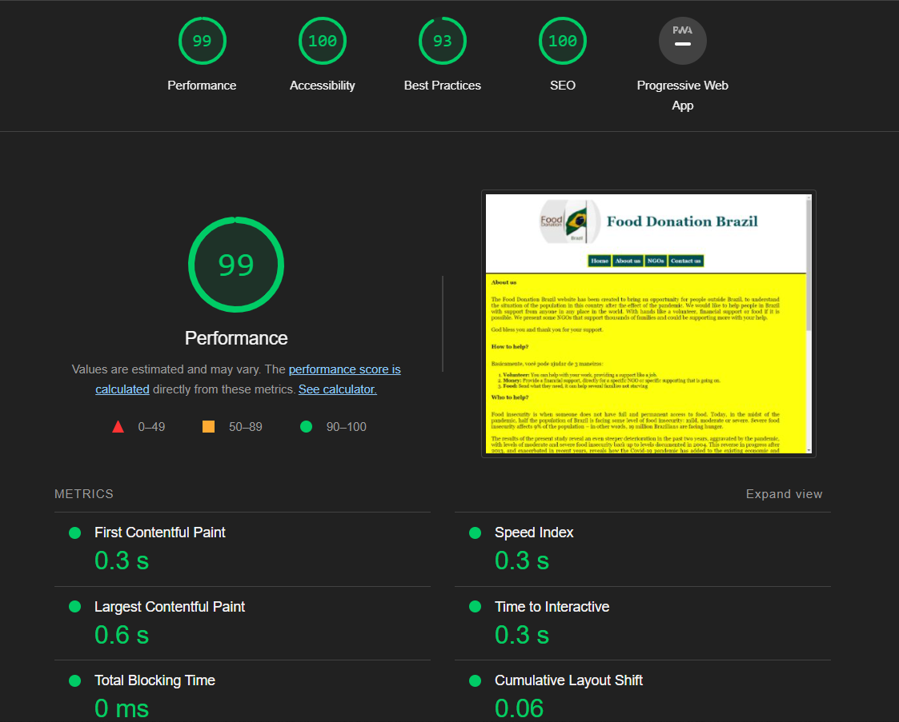

#### NGOs
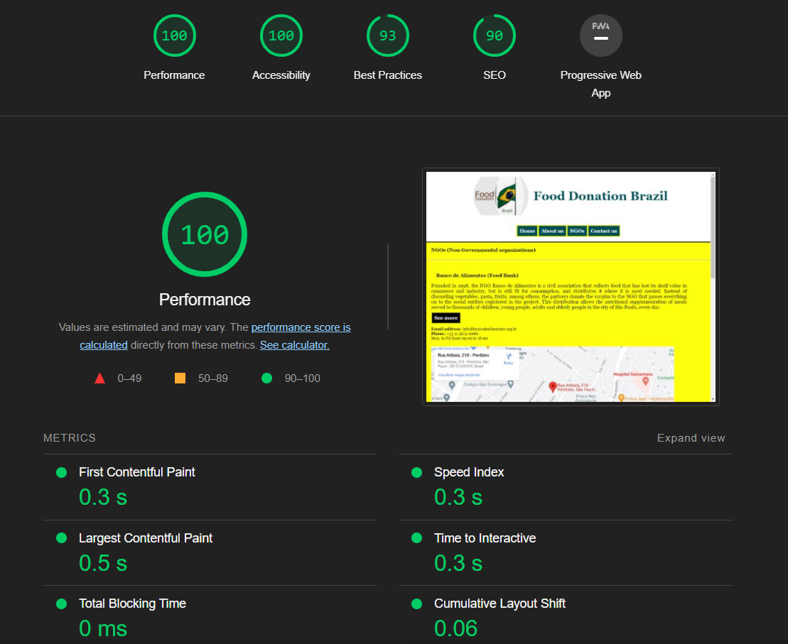

#### Contact us
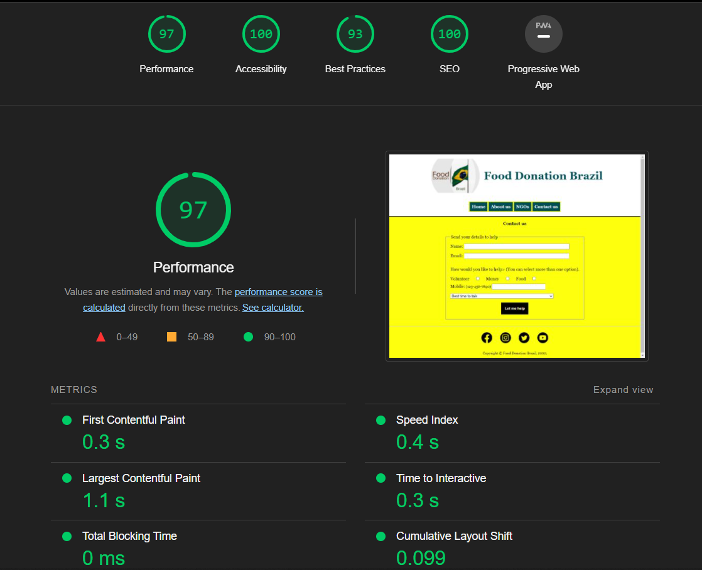
\
I used lighthouse in dev tools to test the website in many ways, for example I had to test my text colors contrast and adjust accordingly.
As you can see by the above screenshot I used this to improve the websites overall performance.

### Chrome Dev Tools and Responsive Mode
Chrome Dev Tools played a huge role in my testing on a day to day basis, I was able to edit my css in real time to confirm the code I'm writing had to correct output as I was coding. It mostly helped when Styling for responsive mode.

### Links
I tested all links across all pages to make sure they all redirect to the correct pages. I also made sure that for links leading to external websites I used the target _blank attribute to open a new tab so the user does not lose place on our website.

### Accessibility

* Each page has been through wave.webaim.org for accessibility testing.\
    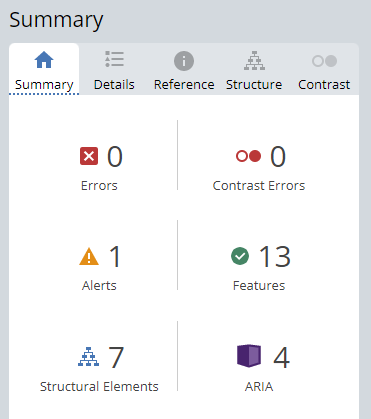

### Unfixed Bugs

No bugs identified that needs to be fixed.

I would like more time for styling some of the items to get more responsive.

----------
# Deployment

## Creating My Website
To create this project I used the Code Institute Gitpod Full Template by navigating [here](https://github.com/Code-Institute-Org/gitpod-full-template) and clicking the button labelled 'Use this template'.

Next I was directed to the 'create new repository from template page' and entered in my repo name, then clicked create repository from template button.

The commands used for commits throughout the project:

git add filename - This command was used to add files to the staging area before committing.
git commit -m "commit message explaining the updates" - This command was used to to commit changes to the local repository.
git push - This command is used to push all committed changes to the GitHub repository.

## GitHub Pages

1. Log in to GitHub and locate the [GitHub Repository](https://github.com/michaelrfreitas/p1_web_fooddonationbrazil)

2. At the top of the Repository (NOT at the top of page), locate the "Settings" Button on the menu.

3. Scroll down the Settings page until you locate the "GitHub Pages" Section.

4. Under "Source", click the dropdown called "None" and select "Master Branch".

5. Click Save and the page will automatically refresh.

6. Scroll back down through the page to locate the now published site link in the "GitHub Pages" section. [Link](https://michaelrfreitas.github.io/p1_web_fooddonationbrazil/)

## Forking
Forks are used to either propose changes to someone else's project or to use someone else's project as a starting point for your own idea. - This is the definition from Github Docs.

1. Navigate to the GitHub Repository you want to fork.

2. On the top right of the page under the header, click the fork button.

3. Fork

4. This will create a duplicate of the full project in your GitHub Repository.

## Clone

1. Navigate to the Github Repository you want to clone.

2. Click the drop down menu labelled "Clone".

3. Either Download the ZIP file, unpackage locally and open with IDE (This route ends here) OR Copy Git URL from the HTTPS dialogue box.

4. Open your developement editor and open a terminal window in a directory of your choice.

5. Use the 'git clone' command in terminal followed by the copied git URL.

6. A clone of the project will be created locally on your local machine.

## Programs used

* GIT
  * For version control, commiting and pushing to github
* GITPOD
  * The IDE used to code this website
* GITHUB
  * Used to store repositories, files and images pushed from gitpod
* Am I Responsive
  * Used to test responsiveness of the website at different screen sizes
* CHROME Developer tools
  * For checking compatibilty, troubleshooting and editing code

----------
## Credits 

### Content
Most of the content and data on this website is from the below location:

[Olhe para a fome (Look at the hunger)](http://olheparaafome.com.br/#manifestu)

[National Survey of Food Insecurity](http://olheparaafome.com.br/VIGISAN_AF_National_Survey_of_Food_Insecurity.pdf)

[Banco de Alimentos (Food Bank)](https://bancodealimentos.org.br/)

[Amigos do Bem (Good Friends)](https://www.amigosdobem.org/)

### Media

#### Images
[Social Media Icons](https://www.iconfinder.com/social-media-icons)

[Photo by Joel Muniz](https://unsplash.com/@jmuniz?utm_source=unsplash&utm_medium=referral&utm_content=creditCopyText) on [Unsplash](https://unsplash.com/s/photos/food-donation?utm_source=unsplash&utm_medium=referral&utm_content=creditCopyText)

### Acknowledgment
I'd like to thank my mentor [Benjamin Kavanagh](https://github.com/BAK2K3) for his guidance and support throughout my project.

-----------
## Tools

[HTML - W3C Validator](https://validator.w3.org/)
Validating my HTML
\
[CSS - Jigsaw Validator](https://jigsaw.w3.org/css-validator/)
Validating my CSS
\
[Chrome Lighthouse and Chrome Developer Tools](https://developers.google.com/web/tools/lighthouse)
To check website performance
\
[GitPod](https://www.gitpod.io/)
Dev Environment using GIT to commit changes to Github
\
[GitHub](https://github.com/)
Stores repository and version control
\
[I am responsive](http://ami.responsivedesign.is/)
Screenshot the website to a responsive design
\
[Character Count](https://www.charactercountonline.com/older-versions/v2/)
Count the character to add commit with max 50 characteres
\
[Comment best-practice](https://gist.github.com/ryansechrest/8693303#3-comments)
See best practice to add a comment in your code
\
[CSS Reference](https://www.w3schools.com/cssref)
Library for CSS code
\
[Markdown Cheatsheet](https://github.com/adam-p/markdown-here/wiki/Markdown-Cheatsheet)
This is intended as a quick reference and showcase
\
[WAVE](https://wave.webaim.org/)
WAVE Web Accessibility Evaluation Tool for accessibility validation